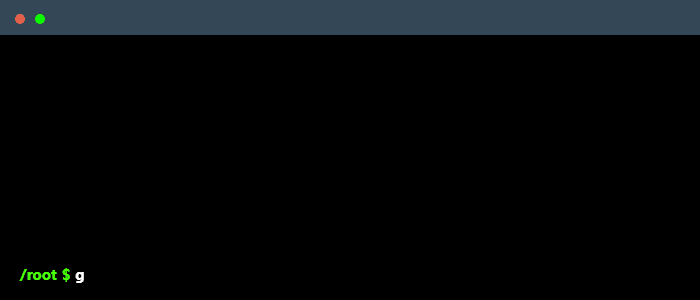

[](https://www.youtube.com/watch?v=SDkAGkd4NLc)

<div align="center">

# Ng Qi Ding

### Director @ Innonics | PhD Candidate (AI) | Ex-Binance QA Engineer

*Transforming billion-dollar logistics operations through AI — RM 1.9M+ in secured government contracts*

<br>

[](mailto:ngqiding@gmail.com?subject=Partnership%20Opportunity)
[](https://www.linkedin.com/in/qi-ding-ng/)
[](http://innocount.innonics.ip-ddns.com)


</div>

---


## 🎯 Current Impact

**Director, Innonics Sdn. Bhd.** | Kuala Lumpur, Malaysia  
Leading RM 1.9M+ ($430K USD) in AI infrastructure projects for Malaysia's #10 busiest port  
Managing 28 researchers across 2 MOHE/MOSTI government partnerships  
**80% operational automation** at multi-site container depot operations

**PhD Candidate** | Universiti Malaya (QS #58)  
Fast-tracked from Master's (completed in 10 months) to PhD  
**3 patents in application** | Published researcher (Elsevier, IEEE)  
Research focus: Energy-efficient AI for autonomous systems

**Ex-QA Engineer** | Binance Holdings Ltd.  
Built test automation for FIAT division serving **90M customers, $76B daily volume**  
Saved **>100 engineering hours/week** through intelligent monitoring systems

<br>

## 💡 Core Expertise

```python
class ExceptionalTrajectory:
    def __init__(self):
        self.academic_excellence = {
            "undergrad": "First-Class Honours (3.96/4.00 GPA)",
            "masters": "Completed in 10 months → Fast-tracked to PhD",
            "current": "PhD Candidate @ Universiti Malaya (QS #58)",
            "patents": "3 inventions (applications in-process)",
            "publications": ["Elsevier Q1 Journal", "IEEE Conference"]
        }
        
        self.industry_validation = {
            "binance": {
                "scope": "90M users, $76B daily trading volume",
                "impact": ">100 engineering hours saved weekly",
                "division": "FIAT payments infrastructure"
            },
            "innonics": {
                "contracts": "RM 1.9M+ ($430K USD) secured",
                "scale": "Multi-site logistics automation",
                "team": "28 researchers managed",
                "partnerships": ["MOHE MyLab", "MOSTI AIF", "Microsoft Startups", "HKSTP"]
            }
        }
        
        self.competition_dominance = {
            "international": [
                "Best Oral Presentation (UM, 2025)",
                "HK Techathon+ Bronze (vs MIT, NUS, NTU, TsingHua, 2024)",
                "SATU SMART Innovation (NCKU, 2023)"
            ],
            "national": [
                "Intel Mobile Robotics Champion (2023)",
                "UM Alphathon Gold (WorldQuant, 2023)"
            ]
        }
        
        self.technical_arsenal = {
            "production": ["Docker", "CUDA", "HuggingFace", "PyTorch"],
            "observability": ["Grafana", "OpenTelemetry", "SQL"],
            "research": ["Deep Learning", "Computer Vision", "Transformers"],
            "certifications": [
                "Graduate Technologist (MBOT)",
                "Top 5% ML Engineer (Pro5.ai)",
                "NVIDIA CUDA Certified",
                "WorldQuant Research Consultant"
            ]
        }
        
    def seeking(self):
        return {
            "role": ["Senior ML Engineer", "AI Research Lead", "Technical Co-Founder"],
            "focus": ["AI Infrastructure", "Computer Vision", "MLOps at Scale"],
            "stage": ["Series A+", "Established Tech", "High-Growth Startups"],
            "geography": "Open to relocation (currently KL, Malaysia)",
            "compensation": "Competitive + Equity"
        }
```


<br>

## 🚀 Flagship Projects

<table>
<tr>
<td width="50%">

### 🏗️ Smart Container Management System
**Client**: Malaysia MOHE (MyLab Program)  
**Value**: RM 1.59M (~$360K USD) | Feb 2026 - Feb 2028

- Leading public-private partnership
- Multi-site industrial deployment across Peninsular Malaysia
- Transitioning pilot → production at scale
- **Impact**: Automating 80% of depot operations at world's #10 busiest port

**Stack**: Docker, PyTorch, Computer Vision, SQL, Grafana

</td>
<td width="50%">

### 🤖 End-to-End AI Pipeline for Logistics
**Client**: Malaysia MOSTI (AIF Program)  
**Value**: RM 346K (~$78K USD) | Nov 2025 - May 2027

- Digital transformation under 12th Malaysia Plan
- **5 critical pillars automated**: Registry, Inspection, Repair Estimation, Allocation, Routing
- Novel computer vision approach (90% faster annotation)

**Stack**: Python, Transformers, HuggingFace, CUDA

</td>
</tr>
<tr>
<td width="50%">

### 💰 Binance FIAT Test Automation
**Client**: Binance Holdings Ltd. (Global)  
**Scale**: 90M users, $76B daily volume | Jul - Dec 2024

- Forward engineering for production monitoring
- Functional & regression test automation
- **>100 man-hours saved weekly**
- Enabled rapid iteration for compliance-critical features

**Stack**: Python, Selenium, CI/CD, Monitoring Tools

</td>
<td width="50%">

### 🔬 DIC Microscopy AI Pipeline
**Publication**: Elsevier (Q1 Journal) | Dec 2023

- Deep learning for biological image analysis
- Analyzing mechanochemical microenvironments
- Differential interference contrast microscopy
- **90% reduction in cell image annotation time**

**Stack**: PyTorch, OpenCV, NumPy, Scientific Computing

</td>
</tr>
</table>

<br>

### 🏆 Award-Winning Research & Competition Track Record

- **🥇 Best Oral Presentation** - Innovation Expo & International Transdisciplinary Research Conference (Oct 2025)
- **🥉 HK Techathon+ 2024** - Bronze in Smart City track, competing vs MIT, NUS, NTU, TsingHua (Jan 2024)
- **🥇 UM Alphathon 2023** - Gold tier medalist (WorldQuant) (Nov 2023)
- **🥇 Mobile Robotics Champion** - Intel & SCUTTLE Robotics Asia, beat all Malaysian universities (Oct 2023)
- **🏅 SATU SMART Innovation** - Led novel single-cell segmentation research for NCKU competition (Oct 2023)

<br>

<div align="center">

## 🛠️ Technology Arsenal

### **Production Systems** | *Scale MVP to production*


### **Research & AI** | *Create specialized models*


### **Enterprise Observability** | *Logs, metrics, traces*


### **Additional Skills**


</div>

<br>

## 📊 Quantified Impact

<div align="center">

| Metric | Achievement |
|--------|------------|
| **Government Contracts Secured** | RM 1.9M+ (~$430K USD) across 2 major projects |
| **Operational Automation** | 80% of depot operations at world's #10 busiest port |
| **Team Leadership** | 28 undergraduate/postgraduate researchers managed |
| **Engineering Efficiency** | >100 man-hours saved weekly at Binance |
| **Research Velocity** | 90% reduction in cell image annotation time |
| **Academic Excellence** | 3.96/4.00 GPA | Master's in 10 months | 3 patents pending |
| **Publications** | Q1 Elsevier Journal + IEEE Conference |
| **Competition Success** | 5 major awards (3 international, 2 national) |
| **Binance Scale** | Supported 90M users, $76B daily trading volume |
| **Strategic Partnerships** | Microsoft Startups, HKSTP, MOHE, MOSTI, Universiti Malaya |

</div>

<br>

## 🎓 Research & Publications

**Published Works:**

- **"A Deep Learning-Based Pipeline for Analyzing the Influences of Interfacial Mechanochemical Microenvironments on Spheroid Invasion Using Differential Interference Contrast Microscopic Images"**  
  *Elsevier Q1 Journal* | December 2023  
  Novel approach to biological image analysis using deep learning

- **"Energy-Efficient Continual Learning for Autonomous Driving"**  
  *IEEE Conference* | November 2023  
  Research on sustainable AI for autonomous vehicle systems

**Patents (In Application):**
- 3 inventions related to AI-powered logistics and computer vision systems

**Academic Recognition:**
- Fast-tracked Master's → PhD (10-month Master's completion)
- First-Class Honours (3.96/4.00 GPA)
- OCBC Bank Scholar
- WorldQuant Certified Research Consultant

**Affiliations:**
- PhD Candidate, Universiti Malaya (QS #58 globally)
- Graduate Technologist, Malaysia Board of Technologists (MBOT)
- Reference: Prof. Dr. Loo Chu Kiong, [Faculty of CS & IT](https://umexpert.um.edu.my/ckloo-um)

<br>

## 💼 What Makes This Profile Exceptional

**Proven Execution Under Pressure**: From securing RM 1.9M in government contracts to delivering test automation at Binance scale — demonstrated ability to operate in both startup and enterprise environments.

**Research-to-Production Pipeline**: Published researcher who ships. Not just theoretical knowledge — real production systems automating critical logistics operations.

**Rapid Learning Curve**: Completed Master's in 10 months while leading research teams. WorldQuant certified. Top 5% ML Engineer (Pro5.ai). 15+ professional certifications across AI, blockchain, cybersecurity.

**Multilingual & Cross-Cultural**: Native proficiency in English, Mandarin, Malay. Professional Hokkien. Experience working with teams across Malaysia, Hong Kong, and global organizations.

**Leadership at Scale**: Managing 28 researchers. Mentored 100+ students in programming bootcamps. Proven ability to teach, inspire, and scale teams.

**Government & Enterprise Credibility**: Cleared for MOHE/MOSTI contracts. Microsoft for Startups Founders Hub member. HKSTP Alumni. Partnership with QS #58 university.  

<br>

## 🤝 Open to High-Impact Opportunities

I'm strategically evaluating opportunities that offer:

✅ **Technical challenges** requiring deep AI/ML expertise and production systems thinking  
✅ **Growth trajectory** with clear path to senior technical leadership  
✅ **Mission alignment** in logistics, autonomous systems, computer vision, or Web3  
✅ **Global reach** with opportunity for international collaboration  
✅ **Competitive compensation** reflecting proven track record + equity upside  

**Currently based in**: Kuala Lumpur, Malaysia  
**Open to**: Remote, Hybrid, Relocation (Singapore, Hong Kong, US, Europe)

**Not interested in**: Pure research roles without production impact, early-stage pre-product startups

<br>

<div align="center">

### 📫 Let's Connect

**Email**: ngqiding@gmail.com | **Phone**: (+60) 10-798 8855  
**LinkedIn**: [linkedin.com/in/qi-ding-ng](https://www.linkedin.com/in/qi-ding-ng/)  
**Portfolio**: [innocount.innonics.ip-ddns.com](http://innocount.innonics.ip-ddns.com)

*Typical response time: <48 hours*

---

<br>

## 📈 GitHub Analytics

<p align="center">
  <picture>
    <source media="(prefers-color-scheme: dark)"  srcset="https://raw.githubusercontent.com/nGQD/nGQD/output-3d-contrib/night.svg" />
    <source media="(prefers-color-scheme: light)" srcset="https://raw.githubusercontent.com/nGQD/nGQD/output-3d-contrib/day.svg" />
    
  </picture>
</p>

<br>



<br>

---

<sup>**Fun Fact**: Completed Master's degree in 10 months. Can only release limited code publicly due to stakeholder protections, but always happy to discuss high-level architecture and technical approaches.</sup>

</div>
